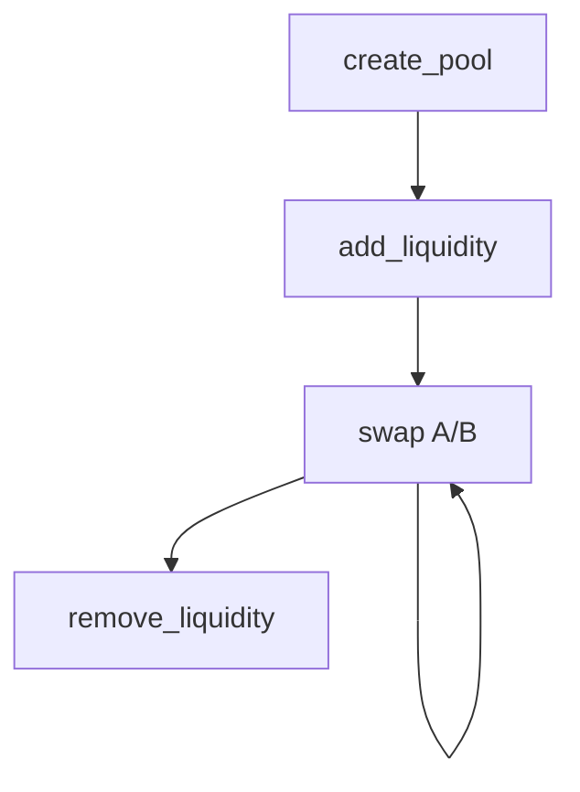

# DEX 兑换合约 (AMM Swap)

基于 Solana + Anchor 的恒定乘积做市合约，支持创建交易池、添加/移除流动性与双向兑换。

[](../../LICENSE)

## 核心功能

- 创建交易池：初始化 `Pool` PDA、双币金库与 LP Mint。
- 添加流动性：按池子比例注入 `token_a/token_b`，铸造 LP 份额。
- 代币兑换：支持 A->B 与 B->A，带最小输出量保护。
- 移除流动性：销毁 LP，按份额赎回底层资产。
- 管理控制：池子支持暂停状态，便于风控处理。

## 交易与流动性流程图



## 技术栈

- Rust 2021 + Anchor `0.32.1`
- `anchor-spl`（`token` / `associated_token` / `token_2022`）
- Solana Program PDA + CPI（SPL Token / Token-2022）

## 经济模型

- 定价模型：恒定乘积 `x * y = k`（见 `swap` 逻辑）。
- 手续费：默认 `3 / 1000`（约 `0.3%`，见 `constant.rs`）。
- 最小流动性：`MINIMUM_LIQUIDITY = 1000`，用于降低初始池被抽干风险。
- LP 份额：首存后按池储备与 LP 总量比例计算新增 LP。

### 关键公式

- 兑换有效输入（扣费后）：

  `dx_eff = dx * (fee_denominator - fee_numerator)`

- 兑换输出（与 `swap` 实现一致）：

  `amount_out = reserve_out * dx_eff / (reserve_in * fee_denominator + dx_eff)`

- 首次注入 LP（扣除最小锁仓）：

  `lp_mint = floor(sqrt(amount_a * amount_b)) - MINIMUM_LIQUIDITY`

- 非首次注入 LP：

  `lp_mint = min(amount_a * lp_total / reserve_a, amount_b * lp_total / reserve_b)`

- 移除流动性赎回数量：

  `amount_a = reserve_a * lp_burn / lp_total`

  `amount_b = reserve_b * lp_burn / lp_total`

## 快速开始

### 安装依赖

```bash
yarn install
anchor --version
solana --version
```

### 本地测试

```bash
anchor build
yarn run ts-mocha -p ./tsconfig.json -t 1000000 "tests/dex_test.ts"
```

### 部署

```bash
anchor build
anchor deploy --program-name dex
```

## 账户结构

- `Pool`（PDA，seed: `pool + token_mint_a + token_mint_b`）
    - 管理员：`authority`
    - 交易对：`token_mint_a` / `token_mint_b`
    - 金库：`vault_a` / `vault_b`
    - LP：`lp_mint` / `lp_total_supply`
    - 手续费参数：`fee_numerator` / `fee_denominator`
    - 储备：`reserve_a` / `reserve_b`
    - 状态位：`paused` / `bump`

## 合约指令

- `create_pool(ctx)`：创建池子与基础配置。
- `add_liquidity(ctx, amount_a, amount_b, min_lp_amount)`：添加流动性并铸 LP。
- `swap(ctx, amount_in, min_amount_out, a_to_b)`：执行兑换并更新储备。
- `remove_liquidity(ctx, lp_amount, min_a, min_b)`：销毁 LP 并赎回双币。

