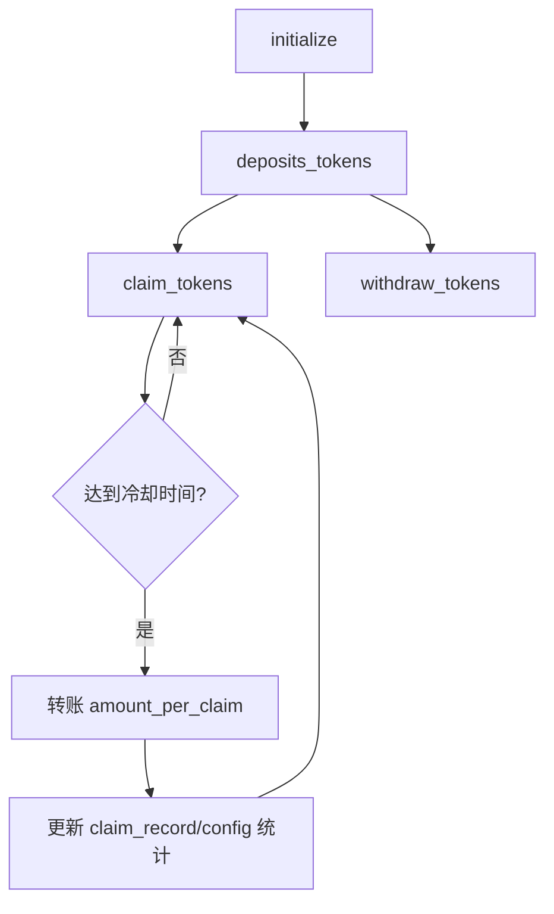

# Faucet 空投合约 (Token Faucet)

基于 Solana + Anchor 的可配置代币水龙头合约，支持按冷却周期领取固定数量代币。

[](../../LICENSE)

## 核心功能

- 初始化水龙头：配置管理员、领取额度、冷却时间与金库。
- 注入资金：管理员可向金库追加可分发代币。
- 用户领取：按用户 `ClaimRecord` 做冷却校验与累计统计。
- 参数更新：管理员可动态调整每次领取量和冷却时长。
- 提取余额：管理员可从金库提取未分发代币。

## 发放流程图



## 技术栈

- Rust 2021 + Anchor `0.32.1`
- `anchor-spl`（`token` / `associated_token` / `token_2022`）
- PDA 状态管理 + Token CPI
- Python 客户端（`anchorpy` / `solana-py`，用于脚本化调用）

## 经济模型

- 每次领取数量：`amount_per_claim`（raw amount，含 decimals）。
- 冷却机制：同一用户两次领取间隔至少 `cooldown_seconds`。
- 默认参数（代码常量）：
    - `DEFAULT_AMOUNT_PER_CLAIM = 1_000_000`
    - `DEFAULT_COOLDOWN_SECONDS = 24 * 3600`
- 领取记录会累计到 `ClaimRecord.total_claimed` 与 `Config.total_distributed`。

### 关键公式

- 冷却判定（用户 `u`）：

  `now - last_claim_at_u >= cooldown_seconds`

- 单次领取转账：

  `transfer_u = amount_per_claim`

- 用户累计领取：

  `total_claimed_u(t+1) = total_claimed_u(t) + amount_per_claim`

- 全局累计分发：

  `total_distributed(t+1) = total_distributed(t) + amount_per_claim`

- 计数器更新：

  `claim_count_u(t+1) = claim_count_u(t) + 1`

  `claim_count_global(t+1) = claim_count_global(t) + 1`

## 快速开始

### 安装依赖

```bash
yarn install
anchor --version
solana --version
```

### 本地测试

```bash
anchor build
yarn run ts-mocha -p ./tsconfig.json -t 1000000 "tests/**/*.ts"
```

### 部署

```bash
anchor build
anchor deploy --program-name faucet
```

## 账户结构

- `Config`（PDA，seed: `config`）
    - `admin` / `mint` / `vault`
    - `amount_per_claim` / `cooldown_seconds`
    - `total_distributed` / `claim_count` / `bump`
- `ClaimRecord`（PDA，seed: `claim_record + user_pubkey`）
    - `user` / `last_claim_at`
    - `total_claimed` / `claim_count` / `bump`

## 合约指令

- `initialize(ctx, amount_per_claim, cooldown_seconds)`：初始化配置。
- `deposits_tokens(ctx, amount)`：向金库充值代币。
- `claim_tokens(ctx)`：用户领取代币并刷新冷却时间。
- `update_config(ctx, amount_per_claim, cooldown_seconds)`：更新水龙头参数。
- `withdraw_tokens(ctx, amount)`：管理员提取金库余额。

