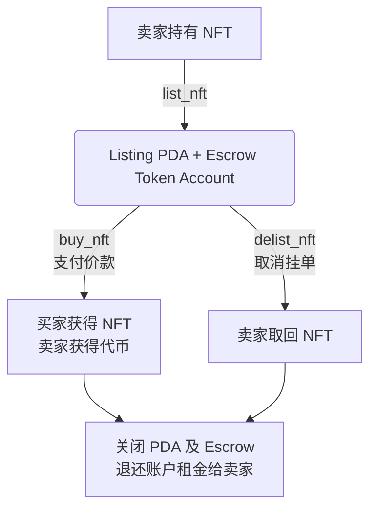

# NFT 市场合约 (NFT Marketplace)

基于 Solana + Anchor 的去中心化 NFT 交易市场合约，支持用户使用自定义游戏代币（$Tangaga）进行 NFT 的挂单、购买与下架操作。

[](../../LICENSE)

## 核心功能

- 挂单 (List)：卖家将 NFT 存入智能合约托管账户 (Escrow)，并设定 $Tangaga 计价。
- 购买 (Buy)：买家支付指定数量的 $Tangaga 给卖家，合约自动将 NFT 转给买家并清理挂单。
- 下架 (Delist)：卖家主动撤销挂单，取回被托管的 NFT。
- 租金回收：购买或下架完成后，托管账户与挂单状态账户自动销毁，占用的 SOL 租金返还给卖家。
- 事件机制：全生命周期支持事件抛出（`NftListedEvent`、`NftBoughtEvent`、`NftDelistedEvent`），便于链外服务监控。

## 交易流程图



## 技术栈

- Rust 2021 + Anchor `0.32.1`
- `anchor-spl`（`token` / `associated_token`）
- PDA 状态管理与 Escrow（托管）模式
- Python 客户端（`anchorpy` / `solana-py`，用于脚本化调用）

## 经济模型

- 定价模型：单一固定价格（一口价），由卖家在挂单时自主设定，计价单位为 $Tangaga 代币。
- 资产安全：挂单期间，NFT 资产存放在由 PDA 控制的 Escrow 账户中，确保买家购买时资产 100% 可用。
- 资金流向：买家支付的代币直接转入卖家钱包，不经过合约截留，实现原子化的点对点兑换。

### 关键公式

- 买家余额校验：

  `buyer_token_balance >= listing.price`

- 购买资金转移：

  `buyer_token_balance' = buyer_token_balance - price`

  `seller_token_balance' = seller_token_balance + price`

- 租金回收（触发于 `buy_nft` 或 `delist_nft`）：

  `Close(escrow_nft_account) => SOL_seller' = SOL_seller + rent_exempt_lamports(escrow_nft_account)`

## 快速开始

### 安装依赖

```bash
yarn install
anchor --version
solana --version
```

### 本地测试

```bash
anchor build
yarn run ts-mocha -p ./tsconfig.json -t 1000000 "tests/nft_marketplace.ts"
```

### 部署

```bash
anchor build
anchor deploy --program-name nft_marketplace
```

## 账户结构

- `Listing`（PDA，seed: `listing + nft_mint`）
    - `seller`：挂单人（卖家）的公钥。
    - `nft_mint`：被挂单 NFT 的 Mint 地址。
    - `price`：设定的 $Tangaga 价格。
    - `bump` / `escrow_bump`：PDA bump 值。
- `Escrow Token Account`（PDA，seed: `escrow + nft_mint`）
    - 由合约托管的 Token Account，所有权 (authority) 归属于 Listing PDA。

## 合约指令

- `list_nft(ctx, price)`：卖家挂单，将 NFT 转入 Escrow，并设定买断价格。
- `buy_nft(ctx)`：买家按标价购买 NFT，原子化完成 $Tangaga 代币支付与 NFT 交割。
- `delist_nft(ctx)`：卖家取消挂单，从 Escrow 取回被托管的 NFT。

