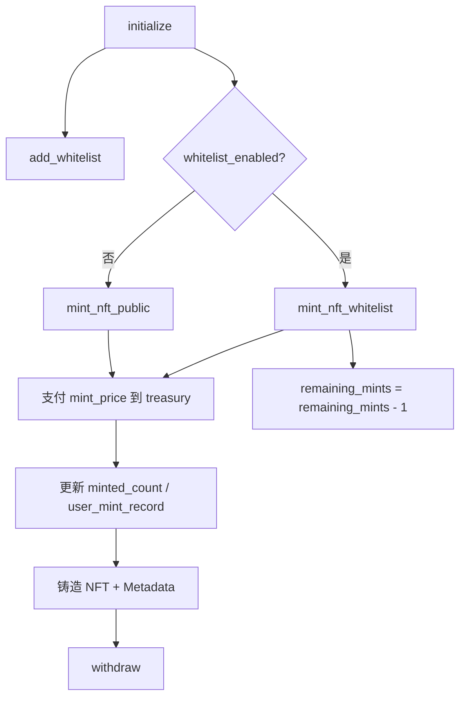

# Skins NFT 合约 (NFT Minting)

基于 Solana + Anchor 的 NFT 铸造与权限管理合约，支持公开铸造、白名单铸造与冻结控制。

[](../../LICENSE)

## 核心功能

- 合约初始化：设置管理员、铸造价格、供应上限、白名单开关等。
- 白名单管理：管理员可给地址分配可铸造次数。
- 双通道铸造：支持 `mint_nft_public` 与 `mint_nft_whitelist`。
- 资金提取：管理员从 `treasury` 提取铸造收入。
- NFT 管理：支持冻结、解冻、转移 Update Authority、撤销冻结权限、转移 NFT。

## 铸造流程图



## 技术栈

- Rust 2021 + Anchor `0.32.1`
- `anchor-spl`（`token` / `associated_token` / `metadata`）
- `mpl-token-metadata`（Metaplex Metadata）

## 经济模型

- 铸造价格：`Config.mint_price`（单位 lamports）。
- 供应控制：按 `minted_count < max_supply` 校验。
- 地址配额：按 `user_mint_record.minted_count < max_mint_per_address` 校验。
- 白名单模式：`Config.whitelist_enabled` + `WhitelistEntry.remaining_mints` 控制资格与次数。
- 已铸造统计：`Config.minted_count` 与 `UserMintRecord.minted_count`。

### 关键公式

- 可铸造判定（当前实现）：

  `minted_count < max_supply`

  `user_minted_count < max_mint_per_address`

- 单次铸造资金流：

  `treasury_lamports(t+1) = treasury_lamports(t) + mint_price`

- 全局与用户铸造计数：

  `minted_count(t+1) = minted_count(t) + 1`

  `user_minted_count(t+1) = user_minted_count(t) + 1`

- 白名单铸造额度变化：

  `remaining_mints(t+1) = remaining_mints(t) - 1`

## 快速开始

### 安装依赖

```bash
yarn install
anchor --version
solana --version
```

### 本地测试

```bash
anchor build
yarn run ts-mocha -p ./tsconfig.json -t 1000000 "tests/skins_nft.ts"
```

### 部署

```bash
anchor build
anchor deploy --program-name skins_nft
```

## 账户结构

- `Config`（PDA，seed: `config`）
    - `authority` / `whitelist_enabled` / `mint_price`
    - `max_supply` / `max_mint_per_address` / `mint_paused`
    - `minted_count` / `created_at`
- `WhitelistEntry`（PDA，seed: `whitelist_entry + user`）
    - `address` / `remaining_mints` / `is_added`
- `UserMintRecord`（PDA，seed: `user_mint_record + user`）
    - `user` / `minted_count` / `last_mint_at`
- `Treasury`（PDA，seed: `treasury`）
    - 持有铸造收入 SOL，用于管理员提取。

## 合约指令

- `initialize(ctx, args)`：初始化配置参数。
- `add_whitelist(ctx, args)`：添加白名单用户与额度。
- `mint_nft_public(ctx, name, symbol, uri)`：公开铸造。
- `mint_nft_whitelist(ctx, name, symbol, uri)`：白名单铸造。
- `withdraw(ctx, amount)`：提取金库资金。
- `freeze_nft(ctx)` / `thaw_nft(ctx)`：冻结与解冻 NFT。
- `trans_update_auth(ctx)`：转移 metadata update authority。
- `revoke_freeze_auth(ctx)`：撤销冻结权限。
- `trans_nft(ctx)`：转移 NFT。

