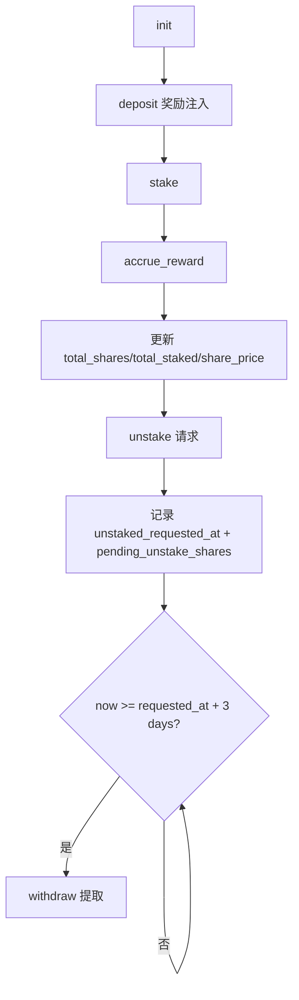

# $Tangaga 质押合约 (Game Token Staking)

基于 Solana + Anchor 的代币质押生息合约。玩家质押代币后按时间累积奖励，解质押后需经过 3 天冷却期才能提取。

[](../../LICENSE)

## 核心功能

- 初始化质押池：设置奖励速率、池子金库与管理员。
- 奖励注入：管理员向池子补充奖励代币。
- 用户质押：按当前份额价格换算为 `shares`。
- 解质押申请：先锁定待提取份额，进入冷却期。
- 到期提取：冷却结束后从池金库提取对应代币。

## 质押流程图



## 技术栈

- Rust 2021 + Anchor `0.32.1`
- `anchor-spl`（`token_2022` / `token_2022_extensions`）
- PDA + Share 份额模型 + CPI 转账

## 经济模型

- 份额模型：使用 `total_shares` 与 `share_price` 表示用户占比。
- 奖励结算：`pending_reward = reward_rate * elapsed_seconds`。
- 价格计算：`share_price = total_staked * SCALE / total_shares`。
- 冷却机制：`COOLDOWN_SECONDS = 3 * 24 * 60 * 60`。
- 用户收益：提取金额由 `shares_to_amount()` 在提取时计算。

### 关键公式

- 奖励累积（`accrue_reward`）：

  `pending_reward = reward_rate * elapsed_seconds`

  `total_staked' = total_staked + pending_reward`

- 份额价格（`total_shares > 0`）：

  `share_price = total_staked * SCALE / total_shares`

- 质押换算份额：

  `shares_minted = amount`（当 `total_shares = 0`）

  `shares_minted = amount * SCALE / share_price`（当 `total_shares > 0`）

- 解质押请求价值（按请求时池状态）：

  `token_amount_request = total_staked * shares_unstake / total_shares`

- 冷却校验：

  `now >= unstaked_requested_at + COOLDOWN_SECONDS`

## 快速开始

### 安装依赖

```bash
yarn install
anchor --version
solana --version
```

### 本地测试

```bash
anchor build
yarn run ts-mocha -p ./tsconfig.json -t 1000000 "tests/staking.ts"
```

### 部署

```bash
anchor build
anchor deploy --program-name staking
```

## 账户结构

- `StakePool`（PDA，seed: `stake_pool + mint`）
    - `admin` / `mint` / `stake_vault`
    - `total_staked` / `total_shares` / `share_price`
    - `reward_rate` / `last_reward_time` / `bump`
- `UserStake`（PDA，seed: `user_stake + pool + user`）
    - `owner` / `pool` / `shares`
    - `staked_amount`
    - `unstaked_requested_at` / `pending_unstake_shares`
    - `bump`

## 合约指令

- `init(ctx, reward_rate)`：初始化质押池。
- `deposit(ctx, amount)`：向池子注入奖励。
- `stake(ctx, amount)`：用户质押并换取份额。
- `unstake(ctx, amount)`：发起解质押申请（进入冷却）。
- `withdraw(ctx)`：冷却完成后提取待解质押资产。

