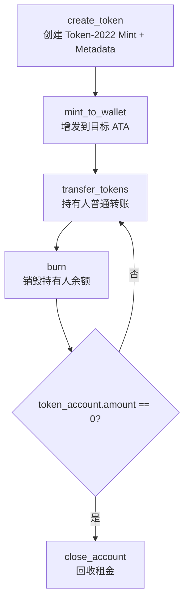
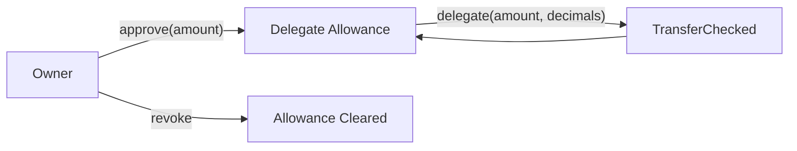

# $Tangaga 代币合约 (Token-2022 Lifecycle)

基于 Solana + Anchor 的 Token-2022 全流程合约，覆盖发币、转账、授权委托、销毁与账户回收。

[](../../LICENSE)

## 核心功能

- 创建 Token-2022 Mint：内置 `MetadataPointer` + Metadata 初始化。
- 铸造到钱包：自动创建 ATA（如不存在）并执行 `mint_to`。
- 普通转账：支持 `transfer_checked` 并自动创建接收 ATA。
- 授权与撤销：支持 `approve` / `revoke` 委托额度控制。
- 代理转账：被授权账户可在额度范围内代持有人转账。
- 销毁代币与关闭账户：支持 `burn` 与空账户租金回收。

## 生命周期流程图



## 授权与委托流程图



## 技术栈

- Rust 2021 + Anchor `0.32.1`
- `anchor-spl` Token-2022 与扩展接口
- SPL Token Metadata Interface（TLV 存储）

## 经济模型

- 合约不维护独立池子或质押状态，主要作为 Token 操作编排层。
- 总供应变化来源：`mint_to_wallet`（增发）与 `burn`（销毁）。
- 授权模型：基于 SPL delegate 额度，支持最小权限委托。
- 账户租金模型：`close_account` 回收空 Token 账户租金。

### 关键公式

- 供应量演化（忽略外部同 mint 程序操作时）：

  `S_t = S_0 + \sum Mint_t - \sum Burn_t`

- 单账户余额变化：

  `B_i(t+1) = B_i(t) + Mint_i + In_i - Out_i - Burn_i`

- 委托额度约束（`approve` / `delegate` / `revoke`）：

  `0 <= x <= A_{owner->delegate}`

  其中 `delegate` 成功转账 `x` 后，剩余额度近似为：

  `A'_{owner->delegate} = A_{owner->delegate} - x`

  `revoke` 后：

  `A_{owner->delegate} = 0`

- 关闭账户前置条件与租金回收：

  `Close(token_account)` 仅当 `balance(token_account) = 0` 成立。

  回收后拥有者 SOL 变化可表示为：

  `SOL_owner' = SOL_owner + rent_exempt_lamports(token_account)`

## 快速开始

### 安装依赖

```bash
yarn install
anchor --version
solana --version
```

### 本地测试

```bash
anchor build
yarn run ts-mocha -p ./tsconfig.json -t 1000000 "tests/tangaga.ts"
```

### 部署

```bash
anchor build
anchor deploy --program-name tangaga
```

## 账户结构

- 该合约当前无自定义持久化 `#[account]` 状态结构。
- 主要依赖 SPL 账户：
    - Token-2022 `mint`（含 metadata 扩展）
    - 用户 `TokenAccount` / ATA
    - `delegate` 授权关系（保存在 TokenAccount 内部字段）

## 合约指令

- `create_token(ctx, name, symbol, uri, decimals)`：创建带元数据扩展的 Mint。
- `mint_to_wallet(ctx, amount)`：铸造代币到目标钱包 ATA。
- `transfer_tokens(ctx, amount)`：普通持有人转账。
- `approve(ctx, amount)`：设置委托额度。
- `revoke(ctx)`：撤销委托。
- `delegate(ctx, amount, decimals)`：委托人代持有人转账。
- `burn(ctx, amount)`：销毁代币。
- `close_account(ctx)`：关闭空 Token 账户并回收租金。

